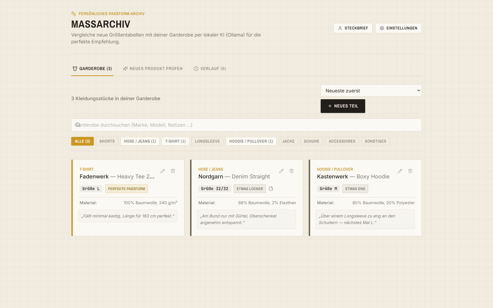
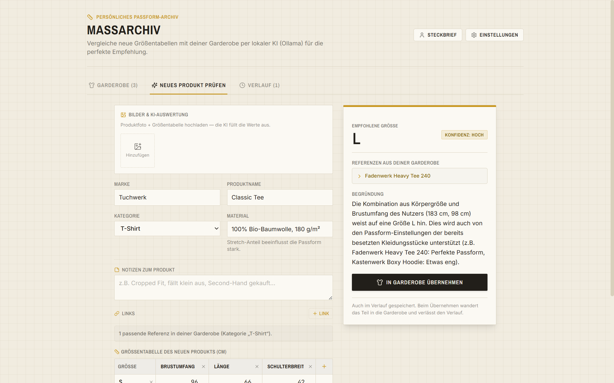

# Maßarchiv

**Dein persönliches Passform-Archiv — lokal, privat, mit KI-Unterstützung.**

Maßarchiv beantwortet die Frage, die sich beim Online-Shopping ständig stellt: *„Welche Größe passt mir bei dieser Marke wirklich?"* Du erfasst die Kleidung, die du besitzt — mit Herstellermaßtabelle und deiner ehrlichen Passform-Rückmeldung („perfekt", „etwas eng", …). Bei einem neuen Produkt vergleicht eine KI dessen Größentabelle mit deiner Garderobe und deinen Körpermaßen und empfiehlt die passende Größe, mit Begründung und Konfidenz.

Alles läuft **lokal auf deinem Rechner**: SQLite-Datenbank, Fotos im lokalen Ordner, KI wahlweise komplett offline über [Ollama](https://ollama.com) — Körperdaten verlassen deinen PC nicht.

## Warum dieses Projekt

Jede Marke misst anders: Bei der einen bin ich M, bei der nächsten L, und die Größentabellen widersprechen sich sowieso. Statt bei jeder Bestellung neu zu raten (und zurückzuschicken), erfasse ich einmal ehrlich, wie meine Kleidung mir passt — und lasse ab dann eine lokale KI neue Größentabellen gegen dieses Archiv vergleichen.

> **Einordnung:** Maßarchiv ist eine Single-User-App für den lokalen Eigengebrauch. Der Server bindet bewusst nur an `127.0.0.1`, es gibt kein Login und keine Mandantenfähigkeit — die App ist nicht für den Betrieb im Netzwerk oder Internet gedacht und hat daher auch nicht die Härtung einer öffentlich betriebenen Software.



*Die Garderobe: Kleidungsstücke mit Größentabelle, Passform-Feedback und Notizen (Demo-Daten).*



*Die Analyse: Größentabelle eines neuen Produkts eingeben — die lokale KI (Ollama) empfiehlt eine Größe mit Begründung, Referenzen und Konfidenz.*

## Features

- **Garderobe** — Kleidungsstücke mit Fotos, Größentabellen (cm), Material, Links und Passform-Notizen; Suche, Kategorie-Filter, Sortierung
- **KI-Größenanalyse** — vergleicht ein neues Produkt mit deiner Garderobe und deinem Steckbrief und empfiehlt eine Größe mit Begründung, Referenzstücken und Konfidenz
- **Foto-Import mit Vision-KI** — Produktfoto + abfotografierte Größentabelle hochladen; die KI erkennt Marke, Kategorie und liest die Tabelle zellgenau aus (zweistufige Extraktion, jede Zelle vor Übernahme editierbar, Halber-Umfang-Erkennung)
- **Steckbrief** — Körpermaße manuell pflegen oder von der KI aus den Passform-Rückmeldungen deiner Garderobe schätzen lassen
- **Verlauf** — alle Analysen mit „In Garderobe übernehmen" und „Erneut prüfen"
- **Backup** — Export/Import als eigenständige JSON-Datei (Fotos eingebettet, API-Key wird nie mit exportiert)
- **4 KI-Provider** — Ollama (lokal, empfohlen), OpenAI, Anthropic Claude, Google Gemini

## Schnellstart

Voraussetzungen: [Node.js](https://nodejs.org) ≥ 18 (getestet mit Node 20).

```bash
git clone https://github.com/rijad-dev/massarchiv.git
cd massarchiv
npm install
npm start
```

`npm start` baut das Frontend beim ersten Mal automatisch und startet den Server. Danach die App im Browser öffnen: **http://localhost:4215**

Die SQLite-Datenbank (`wardrobe.db`) und der Foto-Ordner (`uploads/`) werden beim ersten Start automatisch angelegt.

### KI einrichten (optional, für Analyse & Foto-Import)

Die App funktioniert ohne KI als reines Maß-Archiv. Für Größenempfehlungen und Foto-Auswertung brauchst du **eine** der beiden Optionen:

**Option A — Ollama (lokal & kostenlos, empfohlen):**

```bash
# Ollama installieren: https://ollama.com/download
ollama pull qwen2.5vl:7b   # Vision-Modell (~6 GB) — kann Text UND Bilder
```

In den App-Einstellungen ist Ollama mit `qwen2.5vl:7b` bereits vorausgewählt.

**Option B — Cloud-API:** In den Einstellungen (Zahnrad oben rechts) Provider wählen und API-Key eintragen. Der Key wird **nur lokal im Browser (localStorage)** gespeichert und pro Anfrage über den lokalen Server an den Provider durchgereicht — es gibt keine `.env`-Datei und keinen Server-seitigen Key-Speicher.

## Entwicklung

Der Dev-Modus braucht **zwei** Prozesse (Vite mit Hot-Reload + API-Server):

```bash
npm run server   # Terminal 1: Express-API auf Port 4215
npm run dev      # Terminal 2: Vite-Dev-Server auf Port 5173 (proxyt /api → 4215)
```

Dann http://localhost:5173 öffnen.

```bash
npm run lint     # ESLint (inkl. react-hooks)
npm test         # Vitest-Unit-Tests (pure Logik: Chart-Konvertierung, JSON-Parsing, …)
npm run build    # Produktions-Build nach dist/
```

### Windows-Komfort-Launcher (optional)

`Massarchiv.vbs` doppelklicken (oder als Desktop-Verknüpfung anlegen): startet den Server unsichtbar im Hintergrund, wartet auf den Healthcheck und öffnet die App als rahmenloses Edge-App-Fenster. Auf macOS/Linux stattdessen einfach `npm start` + Browser.

## Architektur

```
Browser (React 18 + Vite + Tailwind)
   │  /api/*
   ▼
Express-Server (server.js, nur 127.0.0.1:4215)
   ├── SQLite (db.js → wardrobe.db): Garderobe, Verlauf, Steckbrief
   ├── uploads/: Fotos (verwaiste Dateien wandern in den Papierkorb uploads-trash/)
   └── LLM-Proxy (llm-proxy.js): Ollama / OpenAI / Anthropic / Gemini
```

- **Local-first:** Der Server bindet ausschließlich an `127.0.0.1` — nichts ist aus dem Netzwerk erreichbar.
- **Offline-fähig:** Fonts sind self-hosted gebündelt (kein CDN); mit Ollama funktioniert auch die KI offline.
- **Fallback-Modus:** Läuft der Server nicht (z. B. reiner `npm run dev`), weicht die App automatisch auf Browser-localStorage aus.
- **Datenformat:** Entitäten liegen als JSON-Blobs in SQLite (`id` + `data`) — bewusst schemalos für ein Single-User-Archiv; Backups tragen eine `version` für spätere Migrationen.

## Datenschutz

Körpermaße und Fotos sind sensible Daten. Deshalb: keine Cloud-Speicherung, keine Telemetrie, Server nur auf localhost, Fotos und Datenbank bleiben im Projektordner (und sind gitignored). Einzige Ausnahme: Nutzt du einen Cloud-KI-Provider, gehen die für die Analyse nötigen Daten (Maßtabellen, Körpermaße, hochgeladene Produktfotos) an dessen API — mit Ollama bleibt auch das lokal.

## Lizenz

[MIT](LICENSE)
